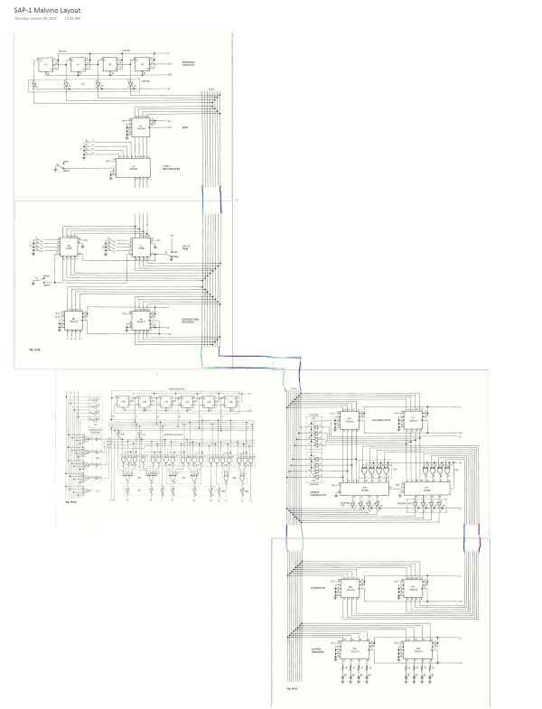
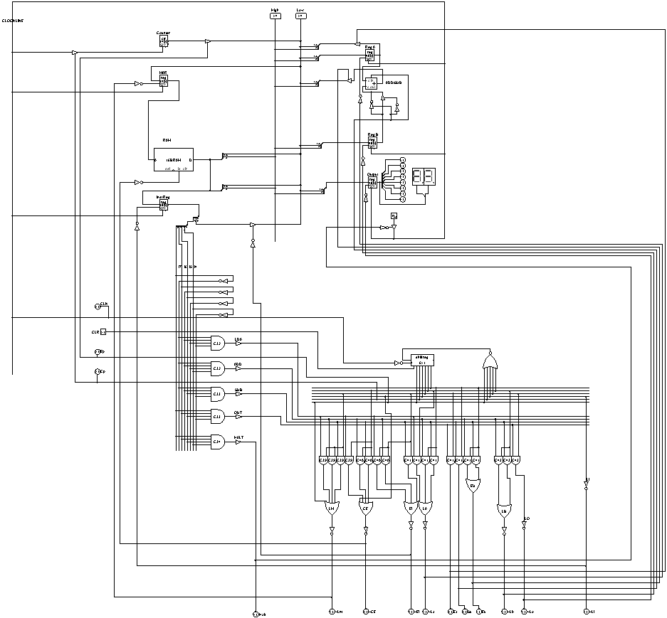

# SAP-1
> Computer Architecture SAP-1 by Malvino

I copied the SAP-1 layout from the Third edition of Malvino's Digital Computer Electronics, as seen in Fig. 10-12, Fig. 10-13, and Fig. 10-15. Logism was used as a simulation instrument, so copying the power supply, clock, and clear circuit was not necessary.

## Malvino Layout

### Version 1 (Jan. 9, 2020)

The table underneath shows the SAP-1 instruction set.
### SAP-2 instruction set
| Mnemonic      | Operation     | OPCODE|
| ------------ | ------------- | ------------- |
| LDA | Load addressed memory contents into accumulator | 0000 |
| ADD | Add addressed memory contents to accumulator | 0001 |
| SUB | Subtract addressed memory contents from accumulator | 0010 |
| OUT | Load accumulator data into output register | 1110 |
| HLT | Stop processing | 1111 |
